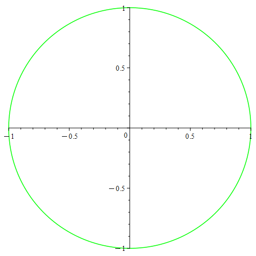
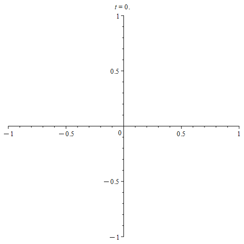
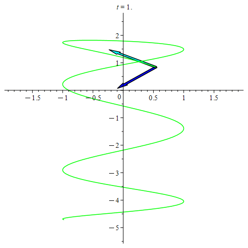
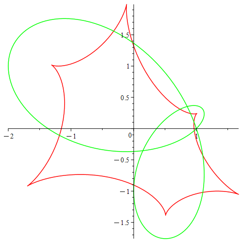
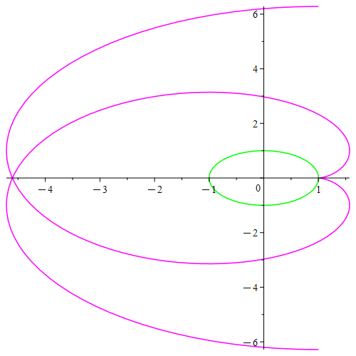

## Overview

This project was part of a group work in my degree in mathematics.
This project was started in 2022.
Goal of this project was calculating different things about [2D curves](https://en.wikipedia.org/wiki/Curve) using [Maple](https://www.maplesoft.com/products/maple/).
This was very difficult because neither of us had learned about [differential geometry](https://en.wikipedia.org/wiki/Differential_geometry) nor used Maple before.
Still this project turned out to be very fun, and we generated beautiful pictures and animated graphics.

We added procedures for plotting and animating curves.

  

  

We added procedures for calculating and animating the [tangent](https://en.wikipedia.org/wiki/Tangent) and [normal](https://en.wikipedia.org/wiki/Normal_(geometry)) lines.

  

We also added procedures for calculating and plotting the [evolute](https://en.wikipedia.org/wiki/Evolute) and [involute](https://en.wikipedia.org/wiki/Involute).

  

  

## How to use

Either just start the `.mw` and run the program or just open the `.html` files in the `HTML` folder.
